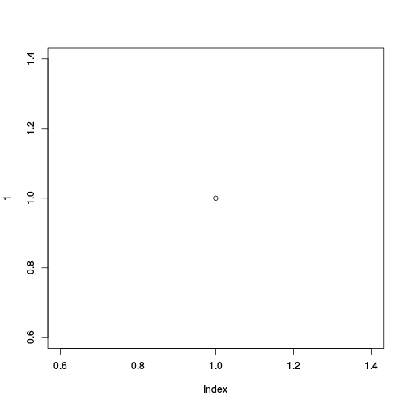

[](http://www.repostatus.org/#wip)
[](https://travis-ci.org/prioritizr/prioritizrdata)
[](https://ci.appveyor.com/project/prioritizr/prioritizrdata)
[](https://codecov.io/github/prioritizr/prioritizrdata?branch=master)
[](https://CRAN.R-project.org/package=prioritizrdata)

# Conservation Planning Data Sets

`prioritizrdata` contains example data sets for conservation planning.


```r
plot(1)
```



**This package is under development, please check back later.**
