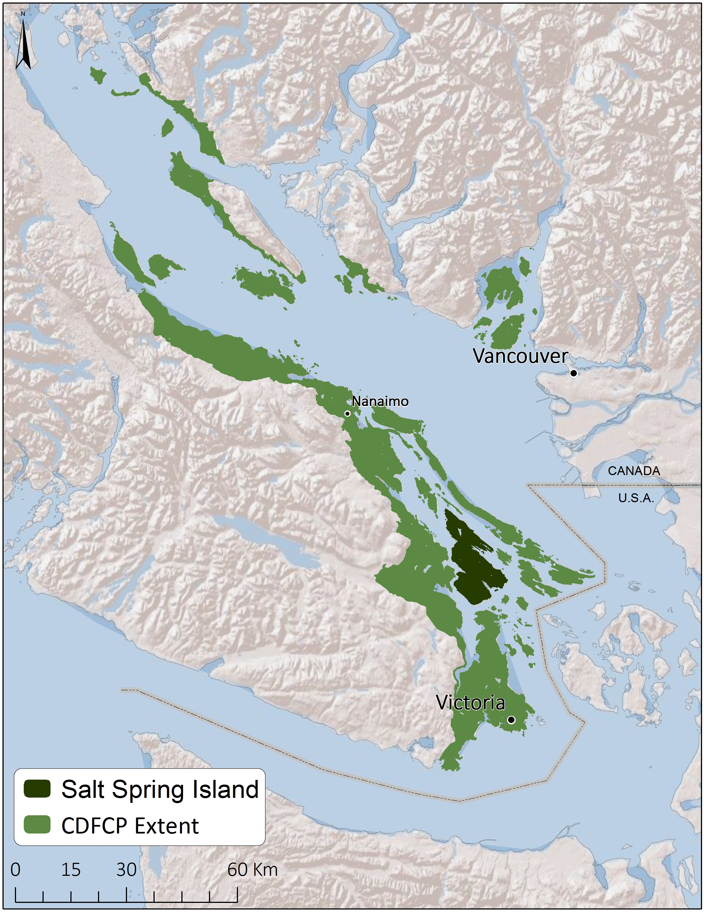

## Introduction
This tutorial is intented to provide a worked example of how raster data can be incorporated into a conservation prioritisation problem with _prioritizr_. 

The data used here is a subset of a much larger dataset for the Georgia Basin obtained as part of an online Marxan-based planning tool created for the Coastal Douglas-fir Conservation Partnership (CDFCP). For simplicity, we focus only on Salt Spring Island, British Columbia. Salt Spring Island is central to the CDFCP region, which supports a very diverse and globally unique mix of dry forest and savannah habitats now critically-threatend due to land conversion, exotic species invasion, and altered disturbance regimes. Known broadly as the Georgia Depression-Puget Lowlands, this region includes threatened Coastal Douglas-fir forest and Oak-Savannah habitats, also referred to as Garry oak ecosystems.

```{r, out.width = "400px", fig.align='center', echo=FALSE}

```

_Figure 1. Location of Salt Spring Island within the Coastal Douglas-fir Conservation Partnership Area_

For more information on the dataset refer to the [Marxan tool portal](http://arcese.forestry.ubc.ca/marxan-tool/) and the [tool tutorial](http://peter-arcese-lab.sites.olt.ubc.ca/files/2016/09/CDFCP_tutorial_2017_05.pdf). 

This tutorial will use functions from the _prioiritizr_ package. Users can refer to the vignettes built into the _prioritizr_ package to familiarize themselves with the basic usage of _prioritizr_ and the theory and mathematics behind the package. 

```{r, echo=TRUE, message=FALSE}
library(prioritizrdata)
library(prioritizr)
# for plotting
library(rasterVis)
library(viridis)
```

## Exploring the data

This dataset contains two components. First, a single-band planning unit raster layer where each one hectare pixel represents a planning unit and contains its corresponding cost (BC Land Assessment 2015). Second, a raster stack containing ecological community feature data. Field and remote sensed data were used to calculate the probability of occurrence of five key ecological communities found on Salt Spring island. Each layer in the stack represents a different community type. In order these are; Old Forest, Savannah, Wetland, Shrub, and a layer representing the inverse probability of occurrence of human commensal species. For a given layer, the cell value indicates the composite probability of encountering the suite of bird species most commonly associated with that community type.

First, load the data into the R environment. 

```{r eval=TRUE}
data(salt_pu) #planning units
data(salt_features) #biodiversity feature 
```

Let's have a look at the planning unit data. Note that we log-transformed the raster to better visualize the variation in planning unit cost.
```{r, eval = TRUE, echo=TRUE, fig.align='center'}
salt_pu
levelplot(salt_pu, main="Planning Units and Cost", zscaleLog = TRUE, margin = FALSE, col.regions=viridis(100))
```

Next, let's look at the feature data.
```{r, eval = TRUE, echo=TRUE, fig.align='center'}
salt_features
levelplot(salt_features, main="Ecological Features", layout= c(3, 2), col.regions=viridis(100))
```

## Example Usage


### Formulating the Problem

```{r eval=FALSE}
p1 <- problem(salt_pu, Saltspring_features) %>%
  add_min_set_objective() %>%
  add_relative_targets(0.17) %>%
  add_binary_decisions()
```
### Solving the problem
### Considering connectivity
### Choosing a solver
