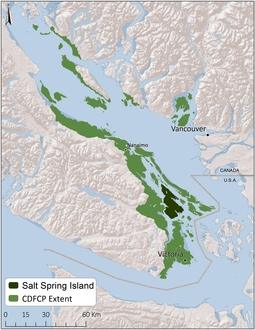

```{r, include = FALSE}
is_check <- ("CheckExEnv" %in% search()) || any(c("_R_CHECK_TIMINGS_",
             "_R_CHECK_LICENSE_") %in% names(Sys.getenv()))
knitr::opts_chunk$set(fig.align = "center", eval = !is_check)
```

### Introduction

This aim of this tutorial is to show how raster data used to build conservation problem with the _prioritizr_ package. For spatial shapefile input data, refer to the [Tasmania vignette](tasmania.html).

The data used here is a subset of a much larger dataset for the Georgia Basin obtained as part of an online Marxan-based planning tool created for the Coastal Douglas-fir Conservation Partnership (CDFCP). For simplicity, we focus only on Salt Spring Island, British Columbia. Salt Spring Island is central to the region, which supports a very diverse and globally unique mix of dry forest and savanna habitats now critically threatened due to land conversion, exotic species invasion, and altered disturbance regimes. Known broadly as the Georgia Depression-Puget Lowlands, this region includes threatened Coastal Douglas-fir forest and Oak-Savannah habitats, also referred to as Garry oak ecosystems.

<center>



</center>

For more information on the dataset refer to the [Marxan tool portal](http://arcese.forestry.ubc.ca/marxan-tool/) and the [tool tutorial](http://peter-arcese-lab.sites.olt.ubc.ca/files/2016/09/CDFCP_tutorial_2017_05.pdf).

Please note that this tutorial will use functions from the _prioritizr R_ package for building and solving conservation planning problems. For more information on the  _prioritizr R_ package, please refer to the [package website](https://prioritizr.github.io/prioritizr).

```{r, message = FALSE}
library(prioritizr)
library(prioritizrdata)
library(rasterVis)
library(viridis)
```

### Exploring the data

This dataset contains two items. First, a single-band planning unit raster layer where each one hectare pixel represents a planning unit and contains its corresponding cost (BC Land Assessment 2015). Second, a raster stack containing ecological community feature data. Field and remote sensed data were used to calculate the probability of occurrence of five key ecological communities found on Salt Spring island. Each layer in the stack represents a different community type. In order these are; Old Forest, Savannah, Wetland, Shrub, and a layer representing the inverse probability of occurrence of human commensal species. For a given layer, the cell value indicates the composite probability of encountering the suite of bird species most commonly associated with that community type.

First, load the data into the R environment.

```{r}
data(salt_pu)       # planning units
data(salt_features) # biodiversity features
```

Let's have a look at the planning unit data. Note that we log-transformed the raster to better visualize the variation in planning unit cost.

```{r}
print(salt_pu)
levelplot(salt_pu, main = "Planning Units and Cost", zscaleLog = TRUE,
          margin = FALSE, col.regions = rev(viridis(100)))
```

Next, let's look at the feature data.

```{r}
print(salt_features)
levelplot(salt_features, main = "Ecological Features", layout = c(3, 2),
          col.regions = rev(viridis(100)))
```

### Formulating the Problem

In this tutorial, we will only cover a few of the many ways that you can formulation a conservation planning problem. The examples we have chosen are intended to highlight how different parameters can radically alter solutions, or in some cases have very effect on the solutions. Here, we use the minimum set objective to fulfill all targets and constraints for the smallest cost. This objective is the same as the objective function used by _Marxan_. For simplicity, we will set biodiversity targets at 17 % to reflect the [Aichi Biodiversity Target 11](https://www.cbd.int/sp/targets/). Because properties on Salt Spring island can either be acquired in their entirety or not at all, we leave the decision framework as the default; binary decision making. This means the planning unit is either selected in the solution or not selected - no partial planning units.

Now we will formulate the conservation planning problem.

```{r}
# create problem
p1 <- problem(salt_pu, salt_features) %>%
      add_min_set_objective() %>%
      add_relative_targets(0.17) %>%
      add_binary_decisions()

# print problem
print(p1)
```

Note that the `%>%` notation is used to attach the objectives, targets, and decisions to the problem. As binary decisions is the default, it does not explicitly need to be added to the problem, but we do add it here for clarity.

### Solving the problem

The _prioritizr_ package supports three different integer linear programming solver packages: _gurobi_, _Rsymphony_, and _lpsymphony_. There are costs and benefits associated with each of these solvers, but the solver itself should have little impact on the actual solution returned (though certain solvers may take longer to return solutions than others).

First, remember that the solvers must be installed. You can check if these packages are installed by running the code below.

```{r}
print(require(gurobi))
print(require(Rsymphony))
print(require(lpsymphony))
```

Now we will try solving the problem using the different solvers. We will also experiment with limiting the maximum amount of time that can be spent looking for each solution.

```{r, message = FALSE, results = "hide"}
titles <- c() # create vector to store plot titles
s1 <- stack()  # create empty stack to store solutions

# create new problem object with added solver
if (require("Rsymphony")) {
  titles <- c(titles, "Rsymphony (5s)")
  p2 <- p1 %>% add_rsymphony_solver(time_limit = 5)
  s1 <- addLayer(s1, solve(p2))
}

if (require("Rsymphony")) {
  titles <- c(titles, "Rsymphony (10s)")
  p3 <- p1 %>% add_rsymphony_solver(time_limit = 10)
  s1 <- addLayer(s1, solve(p3))
}

if (require("gurobi")) {
  titles <- c(titles, "Gurobi (5s)")
  p4 <- p1 %>% add_gurobi_solver(time_limit = 5)
  s1 <- addLayer(s1, solve(p4))
}

if (require("lpsymphony")) {
  titles <- c(titles, "lpsymphony (10s)")
  p5 <- p1 %>% add_lpsymphony_solver(time_limit = 10)
  s1 <- addLayer(s1, solve(p5))
}
```

Now let's visualize the solutions.

```{r, fig.height = 5.5, fig.width = 5}
plot(s1, main = titles, breaks = c(0, 0.5, 1),  col = c("grey70", "darkgreen"))
```

We can see that the solutions returned from the different solvers are not highly sensitive to solver choice for this particular problem. For larger and more complex problem formulations, however, we would expect the solution from _Gurobi_ to be much closer to optimality when setting time limits. At a glance, it also appears that search time settings do not largely impact the solution (2 seconds vs. 5 seconds), but a more rigorous analysis would be necessary to test the true sensitivity for this dataset.

### Adding connectivity

Isolated and fragmented populations are often more vulnerable to extinction. As a consequence, landscape connectivity is a key focus of most conservation planning exercises. There are a number of methods that can be used to increase connectivity in solutions. These methods typically involve adding constraints to a problem to ensure that solutions exhibit a specific property (e.g. selected planning units form a contiguous network), or adding penalties to a problem to penalize solutions that exhibit specific properties (e.g. fragmentation). Here we will explore the effect of adding boundary penalties to penalize fragmented solutions.

Note that we will use default solver hereafter which is automatically added to a problem if a solver is not manually specified.

```{r}
# basic problem formulation
p6 <- problem(salt_pu, salt_features) %>%
      add_min_set_objective() %>%
      add_relative_targets(0.17) %>%
      add_binary_decisions()

# print problem
print(p6)
```

```{r, results = "hide"}
titles2 <- c() # create vector to store plot titles
s2 <- stack()  # create empty stack to store solutions

# no connectivity requirement
titles2 <- c(titles2, "No connectivity")
s2 <- addLayer(s2, solve(p6))

# require at least two for each selected planning unit
titles2 <- c(titles2, "Neighbor constraints (two)")
p7 <- p6 %>% add_neighbor_constraints(2)
s2 <- addLayer(s2, solve(p7))

# impose small penalty for highly exposed boundaries
titles2 <- c(titles2, "Boundary penalty (low)")
p8 <- p6 %>% add_boundary_penalties(50, 0.5)
s2 <- addLayer(s2, solve(p8))

# impose large penalty for high exposed boundaries
titles2 <- c(titles2, "Boundary penalty (high)")
p9 <- p6 %>% add_boundary_penalties(500, 0.5)
s2 <- addLayer(s2, solve(p9))
```

```{r, fig.height = 5.5, fig.width = 5}
# plot solutions
plot(s2, main = titles2, breaks = c(0, 0.5, 1),  col = c("grey70", "darkgreen"))
```

You may also wish to explore the `add_connectivity_penalties` and `add_feature_contiguity_constraints`. These functions use additional data on landscape resistance to provide a more accurate parametrization of connectivity and, in turn, deliver more effective solutions.
